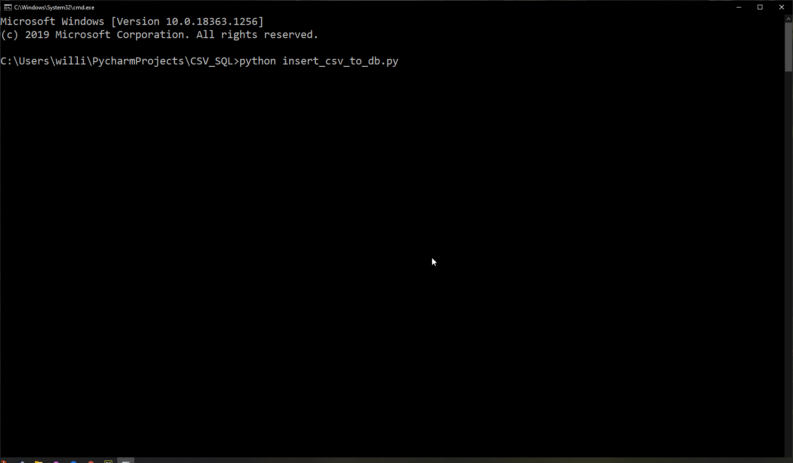
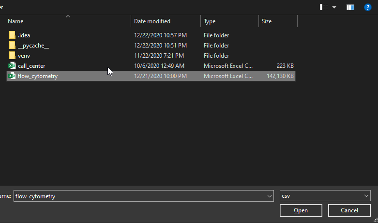
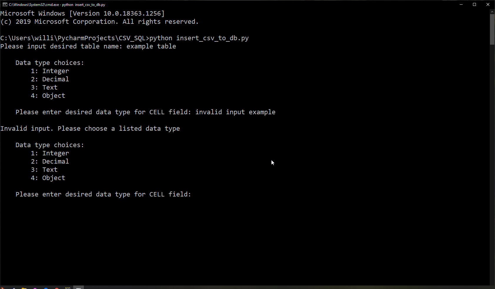
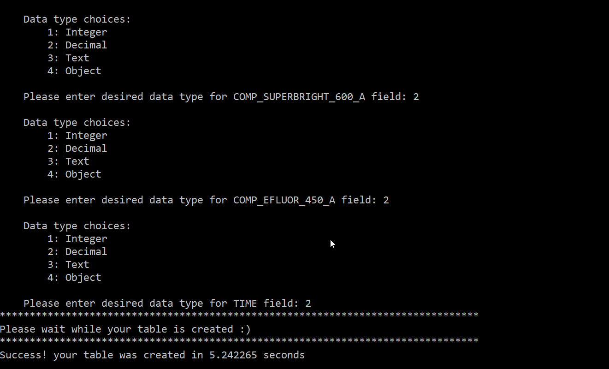

# csv_to_sql

This [program](insert_csv_to_db.py) prompts the user to select a CSV file and then create a database or select an existing one. It then asks for a table name and prompts the user if the table already exists. Each field header is displayed  to the user via [CLI](images/3.png) and they select the data type via input options to prevent incompatible data types. After this the table is created and the values are inserted. [The user is given visual confirmation and a readout of how long the process took.](images/4.png) The [original version](csv_to_sql_insert.py) simply formatted the CSV file into a SQL script and is retained as there is likely a use case. A smaller sample [CSV file](sample_files/call_center.csv) and sample generated database file are available for experimentation.

Revisiting the program allowed me to:

- Utilize better attribute and method names
- make proper use of property decorators

This program and its subsequent revisitations improved my knowledge in the following areas:

- property decoration
- generator behavior
- context managers
- i/o
- custom iteration(tools, limits, and pitfalls)
- utilizing GUI for file-dialog input

